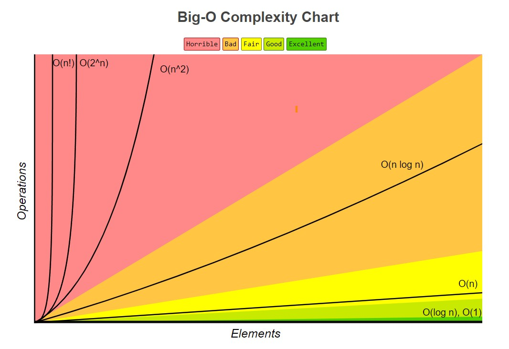

# 01. 자료구조와 알고리즘의 이해

## 01 - 1. 자료구조(Data Structure)에 대한 기본적인 이해

### 👩‍🏫 자료구조

데이터를 표현하고 저장하는 방법

1. 자료구조의 모델에 대한 이해
2. 코드레벨에서 자료구조의 구현

#### 자료구조의 분류

| 선형구조 | 비선형구조 |
| -------- | ---------- |
| 리스트   | 트리       |
| 스택     | 그래프     |
| 큐       |            |

-   **선형 자료구조** : 데이터를 선의 형태로 나란히(일렬로) 저장하는 구조

-   **비선형 자료구조** : 데이터를 나란히 저장하지 않는 구조

### 👩‍🏫 자료구조와 알고리즘

-   **알고리즘** : 표현 및 저장된 데이터를 대상으로 하는 **문제의 해결 방법**

---

e.g)
자료구조 : 배열 선언

```
int arr[5] = {0, 1, 2, 3, 4};
```

배열에 저장된 모든 값의 합을 구하는 알고리즘

```
int sum = 0;
for (int i = 0; i < 5; i++)
{
    sum += arr[i];
}
```

---

#### 자료구조의 결정에 따른 효율적인 알고리즘 결정

-   자료구조가 `배열`이므로 `반복문`과 `배열의 인덱스 값`을 이용한 순차적인 접근을 진행

    -   자료구조에 따라 알고리즘은 달라진다.
    -   알고리즘은 자료구조에 의존적이다.

## 01 -2 알고리즘의 성능 분석 방법

잘 동작하면서, 좋은 성능을 보장 받을 수 있는 자료구조와 알고리즘

### 👩‍🏫 자료구조와 알고리즘을 평가하는 두 가지 요소

1. **시간복잡도** (Time complexity)

    속도 : 수행시간 분석 결과

2. **공간복잡도** (Space Complexity)

    메모리의 사용량

일반적으로 알고리즘을 평가할 때에는 메모리의 사용량보다 **실행속도**에 초점을 둔다.

```
1. 연산의 횟수를 센다.
2. 처리해야 할 데이터의 수 n에 대한 연산횟수의 함수 T(n)을 구성한다
```

-   순차탐색 알고리즘 [LinearSearch.c](c_files/LinearSearch.c)

-   이진탐색 알고리즘 [BinarySearch.c](c_files/BinarySearch.c)

    -   순차탐색보다 좋은 성능
    -   전제 조건 : 배열에 저장된 데이터는 정렬되어 있어야 한다.
    -   탐색의 대상을 반복해서 반씩 줄여나가기 때문에 순차 탐색 알고리즘보다 좋은 성능을 보인다.

#### 순차탐색 알고리즘의 시간 복잡도

대표연산 : `==`

👉 값의 동등을 비교하는 == 연산을 적게 수행하는 탐색 알고리즘이 좋은 탐색 알고리즘

-   순차탐색 알고리즘의 T(n)함수

```
T(n) = n;
O(n)
```

#### 이진탐색 알고리즘의 시간 복잡도

대표 연산 : `==`

👉 값의 동등을 비교하는 == 연산을 적게 수행하는 탐색 알고리즘이 좋은 탐색 알고리즘

-   이진 탐색 알고리즘 T(n)의 함수

```
T(n) = log₂n + 1
O(log n)
```

-   순차 탐색 알고리즘과 이진 탐색 알고리즘 비교 연산 횟수의 확인

    이진 탐색 알고리즘의 비교 연산 횟수 [BSWorstOpCount.c](c_files/BSWorstOpCount.c)

| n      | 순차 탐색 연산 횟수 | 이진탐색 연산횟수 |
| ------ | ------------------- | ----------------- |
| 500    | 500                 | 9                 |
| 5,000  | 5,000               | 13                |
| 50,000 | 50,000              | 6                 |

### 👩‍🏫 빅-오 표기법(Big-Oh Notation)

-   함수 T(n)에서 가장 영향력이 큰 부분이 어딘가를 따지는 것

-   함수 `T(n) = n²+ 2n + 1`의 빅오는 `n²`

    👉 `O(n²)` // 빅-오 오브 n²(Big-Oh of n²)

-   함수 T(n)에서 n²이 차지하는 비율은 절대적이며, n이 증가함에 따라서 2n + 1이 미치는 영향은 미미해진다. (n의 증가 및 감소에 따른 T(n)의 변화 정도가 n²의 형태)

### 👩‍🏫 단순하게 빅-오 구하기

```
T(n)이 다항식으로 표현된 경우, 최고차항의 차수가 빅-오가 된다.
```

### 👩‍🏫 대표적인 빅-오

-   성능(수행시간, 연산횟수)의 대소
<p align="center">
<br>
출처 : <a href="https://www.bigocheatsheet.com/">https://www.bigocheatsheet.com/</a>
</p>

```
O(1) < O(log n) < O(n) < O(n log n) < O(n²) < O(n³) < O(2ⁿ)
```

`O(1)` : 상수형 빅-오

데이터 수에 상관없이 연산횟수가 고정인 유형의 알고리즘

`O(log n)` : 로그형 빅-오

`데이터 수의 증가율`에 비해서 `연산횟수의 증가율`이 훨씬 낮은 알고리즘

`O(n)` : 선형 빅-오

데이터 수와 연산횟수가 비례하는 알고리즘

`O(n log n)` : 선형 로그형 빅-오

데이터 수가 두 배로 늘 때, 연산 횟수는 두 배를 조금 넘게 증가하는 알고리즘

`O(n²)`

데이터 수의 제곱에 해당하는 연산횟수를 요구하는 알고리즘
e.g.)
이중으로 중첩된 반복문 내에서 알고리즘에 관련된 연산이 진행되는 경우
데이터의 양이 많은 경우에는 부적절

`O(n³)`

데이터 수의 세제곱에 해당하는 연산횟수를 요구하는 알고리즘
e.g.)
삼중으로 중첩된 반복문 내에서 알고리즘에 관련된 연산이 진행되는 경우

`O(2ⁿ)` : 지수형 빅-오

사용하기에 비현실적인 알고리즘, 개선필요

### 👩‍🏫 빅-오에 대한 수학적 접근

```
두 개의 함수 f(n)과 g(n)이 주어졌을 때, 모든 n ≥ K에 대하여
f(n) ≤ Cg(n)을 만족하는 두 개의 상수 C와 K가 존재하면,
f(n)의 빅-오는 O(g(n))이다.
```

---

`빅-오` : 데이터 수의 증가에 따른 연산횟수 증가율의 **상한선**을 표현

---

Reference

1. https://www.bigocheatsheet.com/
2. https://www.youtube.com/watch?v=6Iq5iMCVsXA
3. https://www.youtube.com/watch?v=QBZnX_P_dj4
