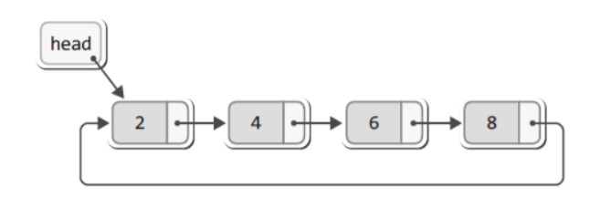
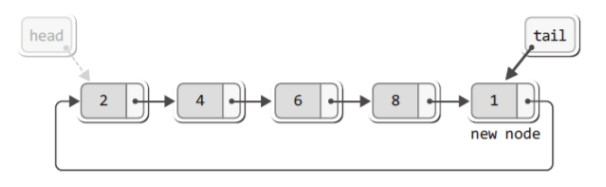

# 원형 연결 리스트

마지막 노드가 첫번째 노드(~NULL~)를 가리키게 하면 **원형 연결리스트**가 된다.

<p align="center"><br>윤성우 저, 열혈 자료구조</p>
이처럼 연결 형태가 원을 이루게 된다.

<p></p>

- 원형 연결 리스트에서는 `head`와 `tail`의 구분이 없다.
- 원형 연결 리스트는 `하나의 포인터변수`만 있어도 머리/꼬리에 노드를 간단히 추가할 수 있다.

## 변형된 원형 연결 리스트

포인터변수 `head`가 머리를 가리키고 있으면, 꼬리에 새로운 노드를 추가하기 위해서는 head부터 `마지막 노드`를 찾아가야 한다.

<p align="center"><br>윤성우 저, 열혈 자료 구조</p>

👉 `tail` 포인터 변수를 사용함으로써 새로운 노드를 리스트의 끝에 쉽게 추가할 수 있다.

  - 꼬리 : `tail`
  - 머리 : `tail -> next`

### 원형 연결 리스트 header

```c
int LNext(List * plist, Data * pdata);
void LInsert(List * plist, Data data);  // 꼬리에 노드 추가
void LInsertFront(List * plist, Data data); // 머리에 노드 추가
```
`LNext`함수는 무한 반복 호출이 가능 : 리스트의 끝에 도달할 경우 첫 번째 노드부터 다시 조회 시작

### 노드 추가

초기 상태 : `tail`이 `NULL`을 가리킴, 추가된 노드가 없음

- 첫번째 노드는 그 자체로 **머리**이자 **꼬리**이므로 첫 노드를 추가한 결과는 `LInsert`와 `LInsertFront`가 동일하다.

- 노드를 **꼬리**에 추가했을 때와 **머리**에 추가했을 때의 유일한 차이점은 `tail`이 가리키는 노드가 다르다는 점 뿐이다.

두 번째 이후의 노드를 **꼬리**에 추가한 경우 (`LInsert`)

```c
else {
  // 생략
  plist->tail = newNode; //
}
```

### 데이터 조회

`LFirst`와 `LNext`함수의 구현

#### 구조체 정의

````c
typedef struct _CLL
{
  Node * tail;
  Node * cur;
  Node * before;
  int numOfData;
}CList
````

- `cur`과 `before`의 초기화 : **LFirst 함수**는 cur이 가리키는 노드의 데이터 반환
- **LNext 함수**: `cur`과 `before`를 한 칸씩 다음 노드로 이동시키고, cur이 가리키는 노드의 데이터를 반환

✔ `LNext`함수에는 리스트의 끝을 검사하는 코드가 존재하지 않는다. (무한으로 호출 가능) : **원형 연결 리스트**의 특성

### 노드 삭제

원형 연결 리스트에는 더미 노드가 존재하지 않으므로 아래 상황을 구분 하여야 한다.
1. 삭제할 노드를 `tail`이 가리키는 경우

    👉 tail이 `다른 노드`를 가리키게 하여야 : 삭제될 노드의 `이전 노드`가 tail이 되어야 한다.
2. 삭제할 노드가 리스트에 `유일한` 노드인 경우

    👉 tail이 `NULL`을 가리키도록 하여야 한다.


```c
//생략
if (rpos == plist->tail)  // 삭제 대상을 tail이 가리킨다면
{
  if(plist->tail == plist->tail->next)  // 그리고 마지막 남은 노드라면
  {
    plist-> tail = NULL; // tail이 NULL을 가리키도록 한다
  }
  else  // 그렇지않다면
  {
    plist-> tail= plist ->before; // 이전 노드를 tail이 되도록 한다
  }
}
```


---
Reference

1.
