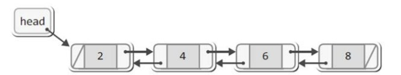
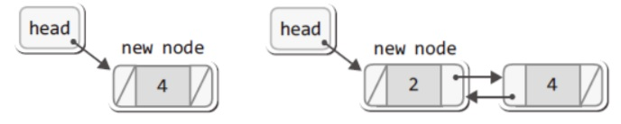

# 양방향 연결 리스트

<p align="center"><br>윤성우 저, 열혈 자료 구조</p>

양방향 연결 리스트는 이중 연결 리스트라고 불리며, 노드가 양쪽 방향으로 연결된 구조이다. 

원형 연결 리스트는 이중 연결 리스트와 달리 `LNext`에서 포인터 변수 `before`를 필요로 하지 않는다.

## 양방향 연결 리스트의 구현

### 리스트 초기화와 노드 삽입

#### 초기화

```c
void ListInit(List * plist)
{
    plist->head = NULL;
    plist->numOfData = 0;
}
```
데이터 조회 목적으로 선언되는 멤버는 `cur` 하나 (`before`불필요) - `LFirst`에서 초기화 되므로 ListInit에서 선언할 필요 없음

#### 노드 삽입

첫 번째 노드를 추가하는 과정과 이후 노드를 추가하는 과정에는 아래와 같이 차이가 있다.

<p align="center"><br>윤성우 저, 열혈 자료 구조</p>


1. 첫번째 노드인 경우 

    양방향 연결리스트가 비어있는 경우 `head`에는 `NULL`이 저장되어 있다.

    👉 새 노드의 `next`와 `prev`를 `NULL`로 초기화하고, `head`가 새 노드를 가리키게 한다

```c
void LInsert(List * plist, Data data)
{
    // 생략
    // plist->head는 NULL인 상태
    newNode->next = plist->head;    // 새 노드의 next를 NULL로 초기화
    newNode->prev = NULL;   // 새 노드의 prev를 NULL로 초기화
    plist->head = newNode;  // 포인터 변수 head가 새 노드를 가리키게 한다
}
```
2. 두 번째 이후의 노드를 추가하는 경우

    👉 `새 노드`와 head가 가리키는 노드(`기존`에 추가되어있던 노드)가 서로를 가리키게 한다.

    👉 `head`가 `새 노드`를 가리키게 하고(head의 이동), 새 노드의 `prev`에 `NULL`을 채운다.

```c
newNode->next = plist->head;    // 새 노드가 기존 노드를 가리키게 한다.
plist->head->prev = newNode;    // 기존 노드가 새 노드를 가리키게 한다.
newNode->prev = NULL;   // 새 노드의 prev에 NULL을 저장
plist->head = newNode;  // 포인터 변수 head가 새 노드를 가리키게 한다.
```

### 데이터 조회

- LFirst, LNext는 단방향 연결리스트에 있던 before가 필요없으므로, 보다 간단히 구현할 수 있다.

- LPrevious

    `LNext`함수 반대방향으로 데이터를 조회하므로 prev를 이용하여 cur를 이동시킨다. (LNext와의 유일한 차이점)

```c
int LPrevious(List * plist, Data * pdata)
{
    // 생략
    plist->cur = plist->cur->prev;  // cur을 왼쪽으로 이동
    *pdata = plist->cur->data;  // cur이 가리키는 노드의 데이터 반환
    return TRUE;
}
```

---