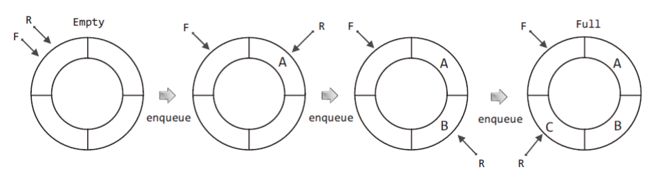

#  Queue

## Queue의 이해

- 큐(Queue)는 선입선출의 자료구조 (First-In, First-Out)

## Queue의 ADT
- 핵심연산 :  `enqueue`, `dequeue` 
```c
void QueueInit(Queue * pq);
int QIsEmpty(Queue * pq);
void Enqueue(Queue * pq, Data data);
Data Dequeue(Queue * pq);
Data QPeek(Queue * pq);
```

## Queue의 배열기반 구현

배열 기반의 큐에서는 '`원형 큐(circular queue)`'형태로 queue를 구현한다.

👉 큐의 머리(F, Front)와 큐의 꼬리(R, Rear)를 회전시켜서 큐를 구성하는 배열을 효율적으로 사용

### 원형 큐(Circular queue)

큐가 꽉 찬 경우나 텅 빈 경우 모두 F가 R보다 한 칸 앞선 위치를 가리키게 된다. 따라서, F와 R의 위치만으로는 큐가 꽉 찬 경우와 텅 빈 경우를 구별 할 수 없다.

✔ 배열의 길이가 N이라면, 데이터의 수가 `N - 1` 일 때, 꽉 찬 것으로 간주한다.


1. 큐가 `처음 생성`(Init)되어 텅 빈 경우에는 F와 R이 **같은 위치**를 가리킨다. 
2. 데이터를 추가(`enqueue`)하면, `R`이 가리키는 위치를 **한 칸 이동**시키고, `R`이 가리키는 위치에 데이터를 **저장**한다.
3. `dequeue` 연산시 `F`가 가리키는 위치를 **한 칸 이동**시킨 후, F가 가리키는 위치에 저장된 데이터를 **반환** 및 **소멸**한다.

<p align="center"><br>윤성우 저, 열혈 자료 구조</p>

👉 구현할 큐의 특성

- 원형 큐가 텅 빈 상태 : `F`와 `R`이 동일한 위치를 가리킨다.
- 원형 큐가 꽉 찬 상태 : `R`이 가리키는 위치의 앞을 `F`가 가리킨다.

### 원형 큐의 구현

[CirculularQueue.h](./files/CircularQueue.h) / 
[CirculularQueue.c](./files/CircularQueue.c) / 
[CirculularQueueMain.c](./files/CircularQueueMain.c)

## Queue의 연결 리스트 기반 구현

### 헤더파일

[ListBaseQueue.h](./files/ListBaseQueue.h)

### 연결리스트 기반 큐의 구현

#### Init
처음 큐가 생성된 이후의 모습은 `F`와`R`이 가리킬 대상이 없으므로 F와 R이 `NULL`을 가리키게 된다.

```c
void QueueInit(Queue *pq)
{
    pq->front = NULL;
    pq->rear = NULL;
}
```

#### QIsEmpty
`F(front)`가 가리키는 노드를 대상으로 `dequeue` 연산이 진행되므로 큐(연결리스트 기반)가 비어있다면 F에 NULL이 저장된 상태이다.

```c
void QIsEmpty(Queue *pq)
{
    if(pq->front == NULL)
        return TRUE;
    else
        return FALSE;
}
```
#### Enqueue

**첫번째 노드**인 경우와 **두번째 이후 노드**인 경우에 차이가 있다. 

- 두번째 이후 노드의 추가인 경우 front는 변하지 않고, `rear`가 새 노를 가리키고, `가장 끝에 있는 노드`가 새 노드를 가리켜야 한다(노드간의 연결)

```c
void Enqueue(Queue *pq, Data)
{
    //생략
    if (QIsEmpty(pq))   // 첫 노드 추가인 경우
    {
        pq->front = newNode;    // front가 새 노드를 가리키고
        pq->rear = newNode;     // rear도 새 노드를 가리킨다.
    }
    else    // 두번째 이후의 노드 추가 인 경우
    {
        pq->rear->next = newNode;   // 마지막 노드가 새 노드를 가리키고,
        pq->rear = newNode;     //rear가 새 노드를 가리킨다.
    }
}
```

#### Dequeue

- `F`가 `다음 노드`를 가리키게 한다
- `F가 이전에 가리키던 노드`를 **소멸** 시킨다.

🤔 F와 R이 `같은 노드`를 가리키고 있을 때, 다시 한 번 `dequeue` 연산을 한다면? 

- F는 NULL을 가리키고 R은 알 수 없는 다른 값을 가리키게 된다. 
- 👉 QIsEmpty 함수를 정의할 때에도 F만을 참조하므로, dequeue과정은 둘로 나뉘지 않는다

```c
Data Dequeue(Queue * pq)
{
    //생략
    If(QIsEmpty(pq))
    {
        //생략
        exit(-1);
    }
    delNode = pq -> front;  // 삭제할 노드의 주소값 저장
    retData = delNode -> data;  // 삭제할 노드가 지닌 값 저장
    pq -> front = pq->front->next;  // 삭제할 노드의 다음 노드를 front가 가리키게 된다.

    free(delNode);
    return retData;
}
```

## 큐의 활용

시뮬레이션 예제를 통한 큐의 활용 형태 (교재 272p~)

[HamburgerSim.c](./files/HamburgerSim.c)