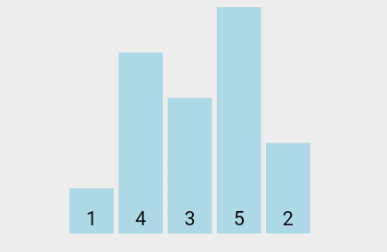
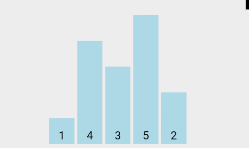
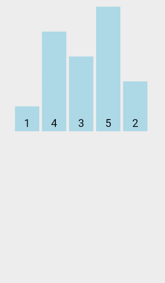

# 정렬(Sorting)

## 단순한 정렬 알고리즘

### 1. 버블정렬 (Bubble Sort)

 visualgo.net

앞에서부터 순서대로 비교하고 교환하는 일련의 과정이 거품이 일어나는 것과 같다고 하여 `버블정렬`이라 한다.

#### 버블정렬의 성능 평가

버블정렬의 빅-오 : `O(n²)`

### 2. 선택정렬 (Selection Sort)

 visualgo.net

정렬의 순서에 맞게 하나씩 선택해서 옮기는 알고리즘

#### 선택정렬의 성능 평가

- 선택 정렬의 빅-오 (**비교 연산**을 기준으로) : `O(n²)`
- 선택 정렬의 빅-오 (**대입 연산**을 기준으로) : `O(n)`

### 3. 삽입정렬 (Insertion Sort)

 visualgo.net

자료배열의 모든 요소를 앞에서 부터 차례로 **이미 정렬된 배열과 비교**하여, 자신의 위치를 찾아 삽입하여 정렬을 완성한다.

#### 삽입 정렬의 성능 평가

삽입 정렬의 빅-오 : `O(n²)`

## 복잡하지만 효율적인 정렬 알고리즘

### 힙 정렬 (Heap Sort)

### 병합 정렬 (Merge Sort)

### 퀵 정렬 (Quick Sort)

### 기수 정렬 (Radix Sort)

---
Reference

1. https://visualgo.net/en
2. https://gmlwjd9405.github.io/2018/05/06/algorithm-insertion-sort.html