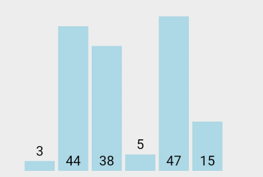
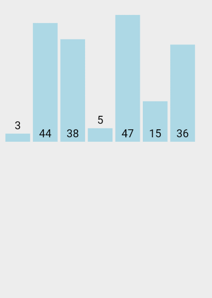
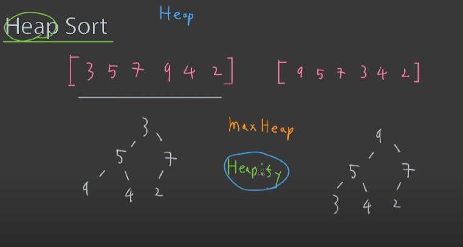
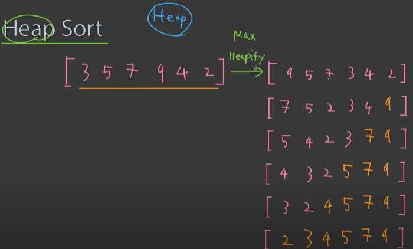
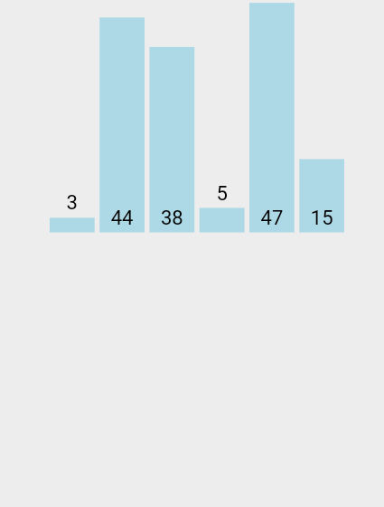
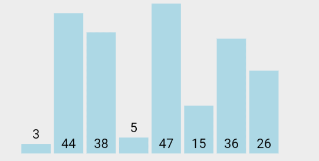
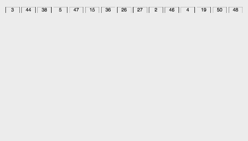

# 정렬(Sorting)

## 단순한 정렬 알고리즘

### 1. 버블정렬 (Bubble Sort)

<p align="center"><br>visualgo.net</p>

앞에서부터 순서대로 비교하고 교환하는 일련의 과정이 거품이 일어나는 것과 같다고 하여 `버블정렬`이라 한다.

#### 버블정렬의 성능 평가

버블정렬의 빅-오 : `O(n²)`

### 2. 선택정렬 (Selection Sort)
<p align="center"><br>visualgo.net</p>

정렬의 순서에 맞게 하나씩 선택해서 옮기는 알고리즘

#### 선택정렬의 성능 평가

- 선택 정렬의 빅-오 (**비교 연산**을 기준으로) : `O(n²)`
- 선택 정렬의 빅-오 (**대입 연산**을 기준으로) : `O(n)`

### 3. 삽입정렬 (Insertion Sort)

<p align="center"><br>visualgo.net</p>

자료배열의 모든 요소를 앞에서 부터 차례로 **이미 정렬된 배열과 비교**하여, 자신의 위치를 찾아 삽입하여 정렬을 완성한다.

#### 삽입 정렬의 성능 평가

삽입 정렬의 빅-오 : `O(n²)`

## 복잡하지만 효율적인 정렬 알고리즘

### 1. 힙 정렬 (Heap Sort)

<p align="center"><br>https://www.youtube.com/watch?v=gB7qYgikT1Y</p>

- `maxHeap`의 특징을 이용 : 힙의 루트노드에 저장된 값이 정렬 순서상 가장 앞서도록 한다.

오름차순으로 정렬하는 예

<p align="center"><br>https://www.youtube.com/watch?v=gB7qYgikT1Y</p>

- 정렬의 대상이 되는 데이터들을 힙에 넣었다가 꺼내는 것으로 정렬이 완료된다.
 - 힙의 루트노드에 저장된 데이터(우선순위가 높은 데이터)가 반환되기 때문

#### 힙 정렬의 성능 평가

- 데이터 저장/삭제 시간 복잡도 : `O(log₂n)`
- 데이터 정렬 시간 복잡도 : `O(nlog₂n)`

### 2. 병합 정렬 (Merge Sort)

<p align="center"><br>visualgo.net</p>

`분할정복 알고리즘`을 사용
- 복잡한 문제를 복잡하지 않은 문제로 `분할`하여 `정복`
- 정복후 `결합`과정 필요

분할하는 과정을 재귀적으로 구현
```c
void MergeSort(int arr[], int left, int right)
{
    int mid;
    // 더 나눌 수 있는 경우 (더 정렬할 요소가 있음)
    if (left < right)
    {
        // 중간지점 계산
        // overflow 방지
        mid = left + (right - left) / 2;
        // 둘로 쪼개서 재귀 호출
        mergeSort(arr, left, mid);
        mergeSort(arr, mid + 1, right); 
        // 병합
        MergeTwoArea(arr, left, mid, right);   
    }
}
```
`MergeTwoArea()` 함수에서 병합할 데이터들을 비교하여 순서대로 병합한다.

#### 병합 정렬의 성능 평가

- 비교 연산 : `O(nlog₂n)`
- 이동 연산 : `O(nlog₂n)`

### 3. 퀵 정렬 (Quick Sort)

<p align="center"><br>visualgo.net</p>

- `pivot`을 기준으로 왼쪽에는 pivot보다 작은 것, 오른쪽에는 pivot보다 큰 것을 위치하게 한다.
- pivot을 기준으로 왼쪽, 오른쪽영역에 같은 작업을 반복한다.

```c
void QuickSort(int arr[], int left, int right) {
    if (left <= right)
    {
        // 반으로 나눔
        int pivot = Partition(arr, left, right);
        // 재귀적으로 호출
        QuickSort(arr, left, pivot - 1);
        QuickSort(arr, pivot + 1, right);
    }
}
```

- `pivot`의 위치
    - 정렬 과정에서 선택되는 피벗의 수는 `Partition()`함수의 호출 횟수
    - `Partition()` 호출 횟수가 많아지면 성능이 떨어진다.
    - 중간에 가까운 값을 pivot으로 선택하면 성능이 좋아지지만, 그에 따른 추가적인 연산이 필요하다.

#### 퀵 정렬의 성능 평가

- 비교 연산의 빅-오 : `O(nlog₂n)`
    - 최악의 경우 `O(n²)` 이지만, 퀵 정렬은 동일한 빅0오를 갖는 다른 정렬 알고리즘 중에서 평균적으로 가장 빠른 정렬속도를 가진다.

### 4. 기수 정렬 (Radix Sort)

<p align="center"><br>visualgo.net</p>

- 자리수끼리 정렬한다 (0 ~ 9) : 1의 자리부터 (`LSD`)
    - 자리수가 다른 경우(8, 10) 과 같은 경우 두 번째 비교는 08, 10으로 생각하여 **0**과 **1**로 생각하여 정렬한다.
    - 교재에서는 이러한 부분을 별도의 알고리즘을 적용해야하는 부분이라고 하여 `서로 다른 길이의 데이터들은 정렬이 불가능하다`라고 표현
- 작은자리수에서 큰 자리수까지 모두 비교하여 정렬한다

- `LSD` vs `MSD`
    - `MSD`는 LSD와 달리 가장 큰 자릿수부터 비교
    - 반드시 마지막 자리수를 비교하지 않아도, 중간에 정렬이 완료될 수 있다. 여기서 멈추지 않고 마지막 자리수를 비교하게 되면 오류가 발생한다. 
    - 오류 방지를 위한 중간 데이터 점검(추가적인 연산)필요

#### 기수 정렬의 성능 평가

기수정렬의 핵심 : 버킷으로의 데이터 삽입 / 추출

- 기수정렬의 빅-오 : `O(n)`
    - 정렬대상 수 : n, 모든 정렬 대상의 길이 : l 👉 `O(ln)`

적용 대상이 제한적이나 퀵 정렬보다 뛰어난 성능

---
Reference

1. https://visualgo.net/en
2. https://gmlwjd9405.github.io/2018/05/06/algorithm-insertion-sort.html
3. 인설션소트 삽입정렬 5분만에 이해하기 https://www.youtube.com/watch?v=iqf96rVQ8fY 
4. 코딩테스트, 초급, 힙소트, 힙정렬, Heap Sort https://www.youtube.com/watch?v=gB7qYgikT1Y
5. [자료구조 알고리즘] 병합정렬(Merge Sort) 구현하기 https://www.youtube.com/watch?v=QAyl79dCO_k
6. 머지소트 병합정렬 5분만에 이해하기 https://www.youtube.com/watch?v=FCAtxryNgq4
7. [자료구조 알고리즘] 퀵정렬(Quicksort)에 대해 알아보고 자바로 구현하기 https://www.youtube.com/watch?v=7BDzle2n47c
8. 3 Fancy Sorts
 https://medium.com/nerd-for-tech/3-fancy-sorts-d1da76689ed2
9. 코딩테스트, 초급, Radix Sort, 계수정렬 https://www.youtube.com/watch?v=7heKwjqkY60